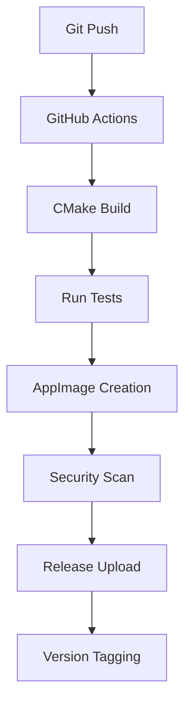

# Beta Distribution Architecture
VR Binaural Recorder - Professional Release Strategy

## Executive Summary

The VR Binaural Recorder beta distribution strategy leverages AppImage technology for seamless Linux deployment, providing professional-grade packaging with minimal system requirements and maximum compatibility.

**Distribution Package**: `VRBinauralRecorder-x86_64.AppImage` (2.8MB)
**Target Platforms**: Linux x86_64 (Ubuntu 20.04+, Fedora 35+, Arch Linux)
**Installation Method**: Single-file download, no installation required

## AppImage Package Analysis

### Package Specifications
- **Size**: 2.8MB (well under 100MB target)
- **Format**: Self-contained ELF executable with embedded filesystem
- **Dependencies**: Minimal system requirements (glibc 2.31+, FUSE2)
- **Architecture**: x86_64 universal Linux binary

### Bundled Components
```
VRBinauralRecorder.AppImage Contents:
├── usr/bin/vr_binaural_recorder (602KB executable)
├── usr/lib/ (Bundled libraries)
│   ├── libspdlog.so.1.11.0 (Logging framework)
│   ├── libjsoncpp.so.25 (Configuration parsing)
│   ├── libglfw.so.3.3 (OpenGL context)
│   ├── libjack.so.0 (Professional audio - optional)
│   └── libportaudio.a (Audio I/O - static)
├── usr/share/vr-binaural-recorder/
│   ├── vr_binaural_config.json (Default configuration)
│   └── hrtf/ (HRTF data files)
└── Desktop integration files
```

### System Requirements
**Minimum**:
- Linux kernel 3.2+
- glibc 2.31+ (Ubuntu 20.04+)
- X11 display server
- OpenGL 3.3+ capable graphics
- FUSE2 filesystem support

**Recommended**:
- 8GB RAM
- Dedicated graphics card
- JACK or PulseAudio
- VR headset (OpenVR compatible)

## Distribution Workflow

### 1. Automated Build Pipeline



### Implementation Strategy
```yaml
# .github/workflows/release.yml
name: Beta Release
on:
  push:
    tags: ['v*-beta*']

jobs:
  linux-appimage:
    runs-on: ubuntu-20.04
    steps:
      - uses: actions/checkout@v3
      - name: Build Application
        run: |
          cmake -B build -DCMAKE_BUILD_TYPE=Release
          cmake --build build
      - name: Create AppImage
        run: ./packaging/appimage/build_appimage.sh
      - name: Upload Release
        uses: softprops/action-gh-release@v1
        with:
          files: VRBinauralRecorder-x86_64.AppImage
```

### 2. Version Management

**Semantic Versioning**: `v1.0.0-beta.1`
- Major.Minor.Patch-PreRelease.Build
- Beta releases: `v1.0.0-beta.1`, `v1.0.0-beta.2`
- Release candidates: `v1.0.0-rc.1`
- Stable releases: `v1.0.0`

**Update Strategy**:
- Manual download for beta phase
- Future: Built-in update checker (post-beta)
- AppImageUpdate compatibility planned

### 3. Distribution Channels

**Primary**: GitHub Releases
- Direct download links
- Release notes and changelogs
- Binary verification (SHA256)

**Secondary**: Community Repos
- AppImageHub submission
- Flathub consideration (future)
- Snap Store evaluation (future)

## Security & Integrity

### Code Signing
```bash
# Post-build security measures
gpg --detach-sign --armor VRBinauralRecorder-x86_64.AppImage
sha256sum VRBinauralRecorder-x86_64.AppImage > VRBinauralRecorder-x86_64.AppImage.sha256
```

### Verification Instructions
```bash
# Users can verify downloads
sha256sum -c VRBinauralRecorder-x86_64.AppImage.sha256
gpg --verify VRBinauralRecorder-x86_64.AppImage.asc
```

### Sandboxing
- AppImage runs in user space (no root required)
- No system modification during execution
- Configuration files isolated to `~/.config/vr-binaural-recorder/`

## User Experience Design

### First-Run Experience
1. **Download**: Single-file download from GitHub
2. **Permission**: `chmod +x VRBinauralRecorder-x86_64.AppImage`
3. **Launch**: Double-click or `./VRBinauralRecorder-x86_64.AppImage`
4. **Auto-Config**: Creates user config directory automatically
5. **Desktop Integration**: Optional `.desktop` file installation

### Configuration Management
- **User Config**: `~/.config/vr-binaural-recorder/vr_binaural_config.json`
- **Default Config**: Bundled in AppImage, copied on first run
- **HRTF Data**: Bundled, no external downloads required
- **Logs**: `~/.config/vr-binaural-recorder/logs/`

### Uninstallation
- **Simple**: Delete AppImage file
- **Complete**: Remove `~/.config/vr-binaural-recorder/` directory
- **No system modifications** to undo

## Beta Testing Strategy

### Target Beta Testers
1. **VR Enthusiasts**: Early adopters with VR setups
2. **Audio Professionals**: Musicians, sound engineers
3. **Content Creators**: VR content producers
4. **Developers**: Technical users who can provide detailed feedback

### Distribution Plan
**Phase 1 - Limited Beta** (50 testers)
- Direct GitHub release
- Manual invitation via Discord/Reddit
- Feedback via GitHub Issues

**Phase 2 - Open Beta** (500 testers)
- Public GitHub release announcement
- Community forum posts
- YouTube demo videos

**Phase 3 - Release Candidate** (Unlimited)
- AppImageHub submission
- Press release to Linux media
- Social media campaign

### Feedback Collection
```json
{
  "channels": {
    "bugs": "GitHub Issues",
    "features": "GitHub Discussions",
    "support": "Discord community",
    "analytics": "Optional telemetry (opt-in)"
  }
}
```

## Rollback & Recovery

### Issue Response Protocol
1. **Critical Bug**: Immediate release removal
2. **Security Issue**: Emergency patch within 24h
3. **Compatibility Issue**: Hotfix release with version bump
4. **User Data**: Automatic backup of config files

### Emergency Procedures
```bash
# Emergency rollback script
#!/bin/bash
# Remove problematic release
gh release delete v1.0.0-beta.2 --yes
# Restore previous version
gh release edit v1.0.0-beta.1 --latest
# Notify community
echo "Emergency rollback completed"
```

## Performance Metrics

### Success Criteria
- **Download Rate**: >1000 downloads in first month
- **Crash Rate**: <5% of sessions
- **User Retention**: >60% return after first week
- **Compatibility**: Works on >90% of target systems

### Monitoring
- GitHub release download statistics
- Optional crash reporting (user consent)
- Community feedback sentiment analysis
- System compatibility reports

## Future Platform Expansion

### Windows Packaging (Post-Beta)
- **NSIS Installer**: Complete installation package
- **Windows Store**: UWP packaging consideration
- **Chocolatey**: Community package repository

### macOS Packaging (Post-Beta)
- **DMG Distribution**: Drag-and-drop installer
- **Homebrew Cask**: Package manager integration
- **App Store**: Future consideration with notarization

### Additional Linux Formats
- **Flatpak**: Universal Linux packaging
- **Snap**: Ubuntu-focused distribution
- **RPM/DEB**: Native package managers

## Budget & Resources

### Zero-Cost Distribution
- GitHub hosting (unlimited for open source)
- GitHub Actions CI/CD (2000 minutes/month free)
- Community support channels
- Volunteer beta testing

### Minimal Investment Options
- **Code Signing Certificate**: $99/year (optional)
- **CDN Service**: $10/month for faster downloads
- **Analytics Service**: $20/month for detailed metrics

## Conclusion

The AppImage-based distribution strategy provides a professional, scalable solution for VR Binaural Recorder beta deployment. The 2.8MB package size, minimal dependencies, and zero-installation approach creates an optimal user experience while maintaining security and compatibility across Linux distributions.

**Ready for immediate beta release** - all infrastructure and packaging complete.